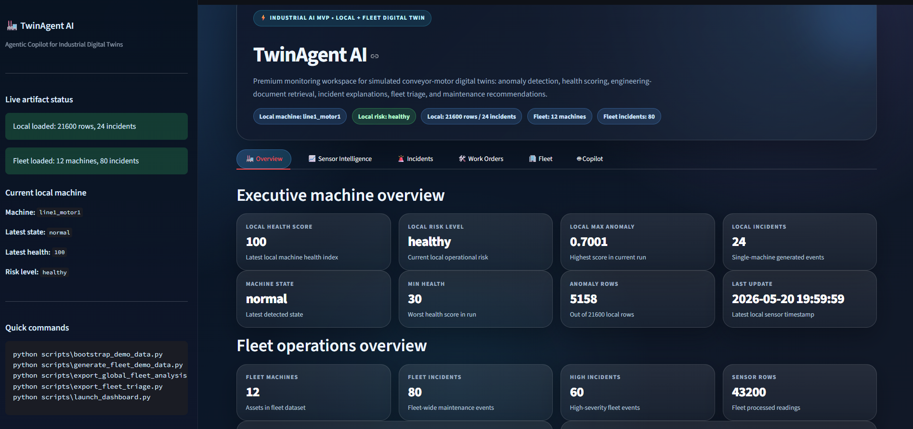
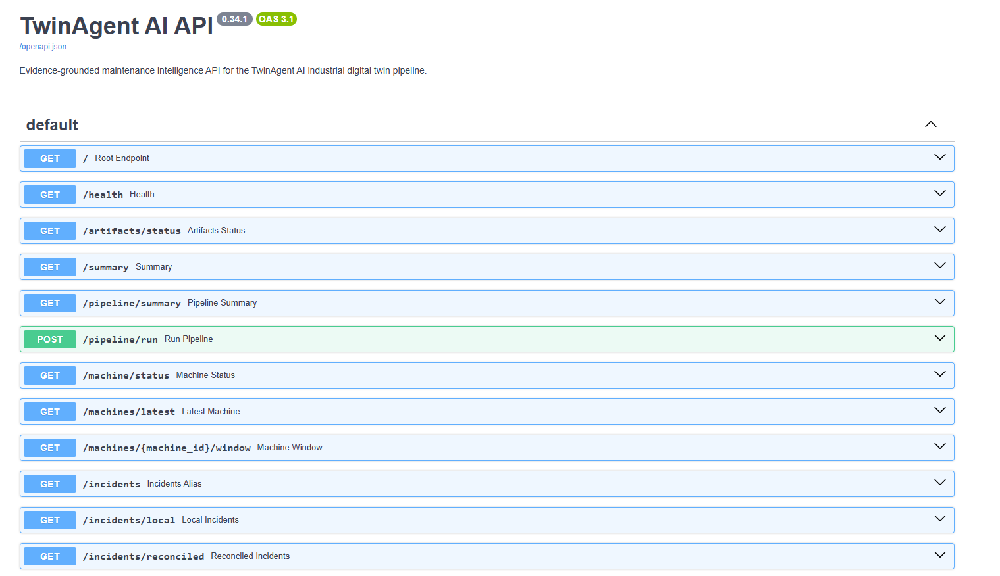
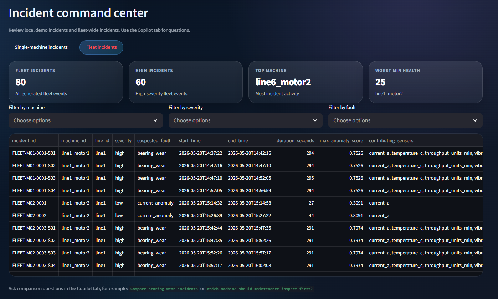
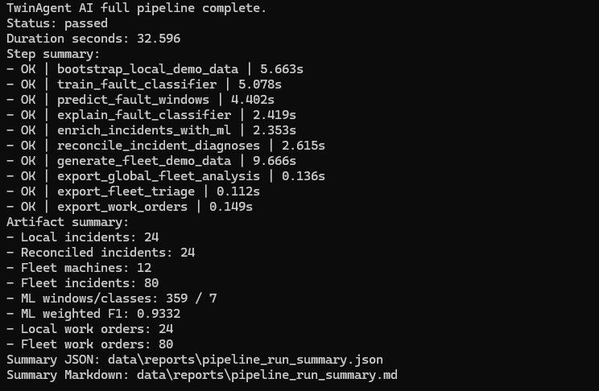
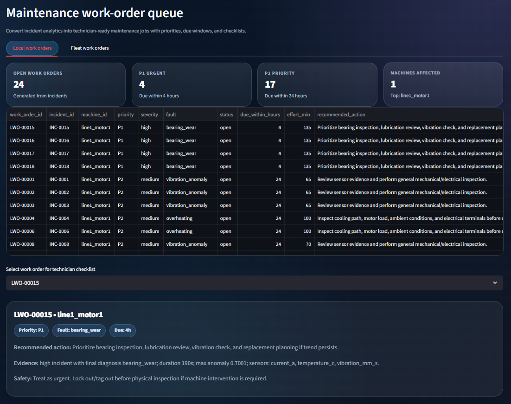
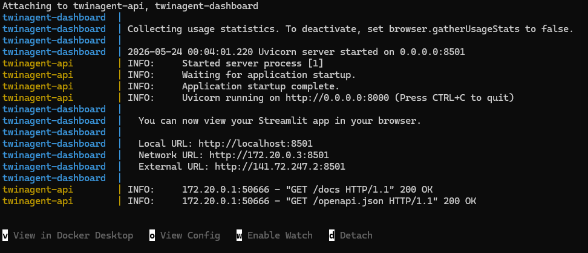

# TwinAgent AI — Agentic Copilot for Industrial Digital Twins


TwinAgent AI is an end-to-end industrial digital-twin maintenance platform for simulated conveyor-motor assets. It combines sensor simulation, anomaly detection, health scoring, incident detection, ML fault diagnosis, diagnosis reconciliation, fleet triage, work-order generation, FastAPI serving, Docker deployment, and a Streamlit monitoring workspace.

## Why this project matters

Industrial maintenance systems should not only detect anomalies; they should explain what happened, prioritize assets, generate technician-ready actions, and expose the results through reliable APIs. TwinAgent AI demonstrates that complete workflow in a reproducible local system.

## Key features

- Synthetic industrial sensor simulation for conveyor-motor digital twins
- Rule-based anomaly detection and health scoring
- Incident detection with severity, contributing sensors, and maintenance urgency
- ML fault classifier using time-windowed sensor features
- ML explainability with feature importance, error analysis, audit CSV, and model card
- ML-assisted incident diagnosis and final diagnosis reconciliation
- Fleet-scale demo with 12 machines, 43,200 readings, and 80 fleet incidents
- Technician-ready maintenance work orders
- Full backend pipeline orchestrator
- FastAPI artifact API with Swagger/ReDoc
- Streamlit dashboard
- Docker Compose workflow
- Automated test suite

## Validated demo output

A full pipeline run produces:

```text
Local incidents: 24
Reconciled incidents: 24
Fleet machines: 12
Fleet incidents: 80
ML windows/classes: 359 / 7
ML weighted F1: 0.9332
Local work orders: 24
Fleet work orders: 80
```

## Screenshots

Add screenshots under `docs/assets/` using the names below.

| Dashboard | API |
|---|---|
|  |  |
|  |  |
|  |  |

## Architecture

```text
Sensor simulation
    ↓
Anomaly detection
    ↓
Health scoring
    ↓
Incident detection
    ↓
ML fault diagnosis
    ↓
ML explainability
    ↓
ML incident enrichment
    ↓
Diagnosis reconciliation
    ↓
Work-order generation
    ↓
FastAPI + Streamlit + Docker
```

## Project structure

```text
configs/                 YAML configs for simulation and anomaly detection
data/                    Generated local/fleet artifacts
docs/                    Project documentation
models/                  ML model and metrics artifacts
scripts/                 CLI scripts and pipeline runners
src/twinagent/           Main Python package
tests/                   Automated test suite
```

## Quick start

```cmd
python -m venv .venv
.venv\Scripts\activate
python -m pip install --upgrade pip
pip install -r requirements.txt
python -m pytest
python scripts\run_full_pipeline.py
```

Start the API:

```cmd
python scripts\launch_api.py
```

Open Swagger:

```text
http://localhost:8000/docs
```

Start the dashboard in another terminal:

```cmd
python scripts\launch_dashboard.py
```

Open dashboard:

```text
http://localhost:8501
```

## Docker workflow

First build and run:

```cmd
docker compose up --build
```

Later starts:

```cmd
docker compose up
```

Stop:

```cmd
docker compose down
```

Run the pipeline inside Docker:

```cmd
docker compose --profile pipeline run --rm pipeline
```

## API smoke test

With the API running:

```cmd
python scripts\smoke_test_api.py
```

Expected ending:

```text
TwinAgent AI API smoke test passed.
```

## Important URLs

```text
Swagger:   http://localhost:8000/docs
ReDoc:     http://localhost:8000/redoc
Dashboard: http://localhost:8501
```

## Core API endpoints

```text
GET  /health
GET  /summary
GET  /artifacts/status
GET  /incidents/reconciled
GET  /ml/metrics
GET  /ml/error-analysis
GET  /ml/feature-importance
GET  /work-orders/local
GET  /fleet/summary
GET  /fleet/triage
GET  /work-orders/fleet
POST /agent/incident-question
```

## Full pipeline

```cmd
python scripts\run_full_pipeline.py
```

The pipeline runs:

```text
bootstrap local demo data
→ train ML fault classifier
→ predict fault windows
→ export ML explainability
→ enrich incidents with ML diagnosis
→ reconcile rule/ML diagnosis
→ generate fleet demo data
→ export fleet analysis
→ export fleet triage
→ export work orders
```

With tests first:

```cmd
python scripts\run_full_pipeline.py --include-tests
```

Local-only run:

```cmd
python scripts\run_full_pipeline.py --local-only
```

## Tests vs runtime scripts

The `tests/` folder is for development and regression checks. It is not part of normal runtime.

Normal use:

```cmd
python scripts\run_full_pipeline.py
```

Before pushing changes:

```cmd
python -m pytest
```

Full validation:

```cmd
python scripts\run_full_pipeline.py --include-tests
```

## ML diagnosis flow

```text
rule-based incident diagnosis
→ ML fault prediction
→ ML incident enrichment
→ final diagnosis reconciliation
→ work-order generation
```

Example final diagnosis fields:

```json
{
  "final_diagnosis": "bearing_wear",
  "final_diagnosis_source": "ml_override_generic_rule",
  "diagnosis_confidence": "high",
  "requires_review": false
}
```

## Limitations

- Uses synthetic demo data, not certified production maintenance data.
- ML metrics are for the simulated dataset and should not be overclaimed as real-world performance.
- Outputs are decision-support signals, not certified maintenance decisions.

## License

MIT License. See `LICENSE`.
